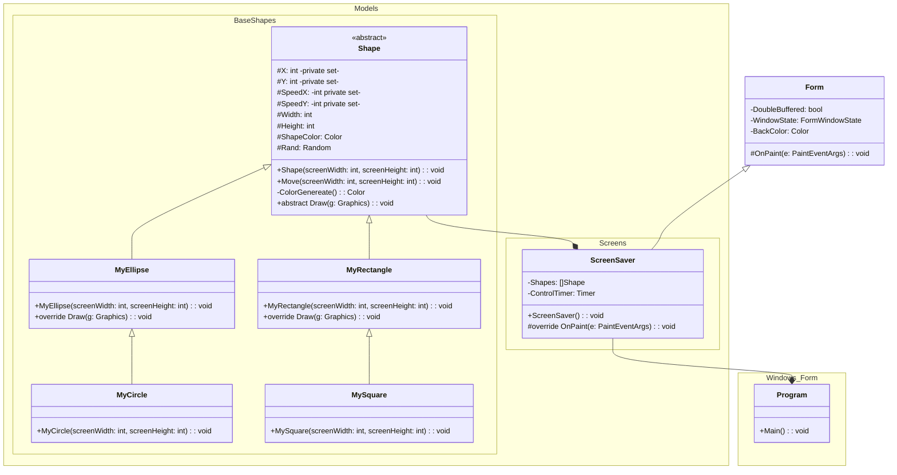
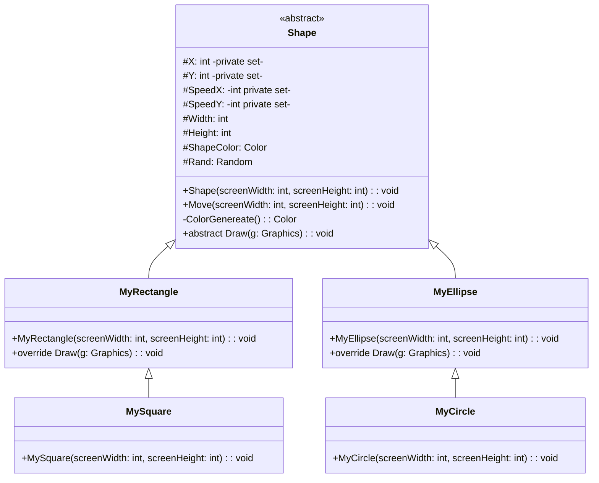

# Miniprojeto: Protetor de Tela

Profº.: Cainã Antunes Silva  
Faculdade de Tecnologia **SENAI Sorocaba**  
Tecnólogo em Análise e Desenvolvimento de Sistemas (ADS)
___


> O objetivo deste miniprojeto é colocar em prática conceitos de herança e polimorfismo, além de implemantar uma classe abstrata.  

A herança é um conceito poderoso em linguagens orientada à objetos, que permite que uma classe filha acesse atributos e métodos de sua classe pai. Associado ao conceito de polimorfismo, deixa os algoritmos mais flexíveis, além de contribuir para evitar a repetição de código.

Para mais informações acesse [Aula 06: Herança, classes abstratas e polimorfismo.](https://cainaantunes.notion.site/Aula-06-Heran-a-Classes-Abstratas-e-Polimorfismo-245bde521b3b806195f6ea9c8d58d4f7?source=copy_link)

***

1. **Miniprojeto:** Protetor de tela

Este projeto consiste, em contruir uma aplicação com Windows Forms, do framework .NET, que realize uma animação no estilo de um protetor de tela, com objetos (formas geométricas - retângulos, quadrados, elipses e circulos) que se movimentam pela tela e mudam de direção e cor quando encontram as bodas da janela.

O diagrama de classes a seguir ilustra a estrutura a ser implementada:


___
### Detalhamento da Herança:

A classe Shape, é uma classe abstrata, ou seja, que não pode ser instanciada. Ela representa toda e qualquer forma geométrica criada na tela da aplicação, isto significa que `Shape` contém todos os atributos e métodos considerados comuns entre qualquer forma geométrica que venha a ser desenhada na tela.

As classes `MyRectangle`, `MySquare`, `MyEllipse` e `MyCircle`, são classe que herdam de `Shape`, mas que possuem diferentes métodos específicos para serem desenhadas na tela e/ou certas formas peculiares de inicializar seus atributos.  


___
### Criar aplicação Windows Forms com .NET:

*Windows Forms* é uma estrutura de interface do usuário que cria aplicativos cliente de área de trabalho avançados para Windows. O comando a seguir cria uma aplicação *Windows Forms* no *VSCode*:

```powershell
dotnet new winforms -n ScreenSaverProject
```
___
### Classe `Program`:

A classe `Program` implementa o método `main`, sendo o principal ponto de entrada na aplicação. Para renderizar a tela do programa, a classe `ScreenSaver` é passada como parâmetro ao chamar o método de execução da aplicação:

```csharp
namespace Windows_Form;

using System;
using System.Windows.Forms;
using Models.Screens;

static class Program
{
    [STAThread]
    static void Main()
    {
        ApplicationConfiguration.Initialize();
        Application.Run(new ScreenSaver());
    }
}
```
___
### Classe `ScreenSaver`:

A classe `ScreenSaver`, é uma adaptação (herda) de um `Form` de aplicações `Windows Forms`. Sua função é renderizar e gerenciar uma tela na aplicação.

O método `OnLoad` é **chamado automaticamente pelo `Windows Forms`** quando o `Form` (sua janela principal) **termina de ser criado e está prestes a aparecer na tela**.

No construtor da classe, parâmetros do `form` como `buffer`, cor de `background` e tamanho da tela são inicializados. Além disso um objeto `Timer` é instanciado, sua função é gerar um evento a cada intervalo de tempo pré-definido. Uma função lambda captura este evento, neste ponto você deve movimentar os objetos que compões a tela, por fim a função lambda chama o método `Invalidate`, que força o Windows a redesenhar o `form` através do método `OnPaint`.

O método `OnPaint` é chamado **toda vez que o Windows precisa redesenhar o conteúdo da janela**. Quanto o método `Invalidate` é chamado, por exemplo.

```csharp
namespace Models.Screens;

using Models.BaseShapes;
using System.Drawing;
using System.Windows.Forms;

public class ScreenSaver : Form
{
    // ******* Declare suas formas geométricas aqui (escopo global) *******

    // ********************************************************************
    private Timer ControlTimer;

    public ScreenSaver()
    {
        this.DoubleBuffered = true;                     // evita flickering
        this.WindowState = FormWindowState.Maximized;   // Maximiza a janela
        // Define a cor de background
        this.BackColor = Color.Black;                   
        // Inicializa o temporizador de controle
        ControlTimer = new Timer();
        ControlTimer.Interval = 16;                     // 16 ms = ~60 fps
        // Controle da animação
        ControlTimer.Tick += (s, e) =>
        {
            // ****** Mova suas formas geométricas aqui ******

            // ***********************************************
                Invalidate(); // Foça a tela a ser redesenhada.
        }; // Função anônima disparada pelo ControlTimer a cada Interval (ms)
        ControlTimer.Start();
    }

    protected override void OnLoad(EventArgs e)
    {
        base.OnLoad(e);
        // ****** Instancie suas formas geométricas aqui ******

        // ****************************************************
    }

    protected override void OnPaint(PaintEventArgs e)
    {
        base.OnPaint(e);
        // ****** Desenhe suas formas geométricas aqui *******

        // ***************************************************

    }
}
```
___
### Como desenhar utilizando `Graphics`:

```csharp
Gaphics g = new Graphics();
using var brush = new SolidBrush(ShapeColor);        
g.FillRectangle(brush, X, Y, Width, Heigth);
g.FillEllipse(brush, X, Y, Width, Heigth);
```
___

# Referências:
[Windows Forms Documentation](https://learn.microsoft.com/pt-br/dotnet/desktop/winforms/)
[Graphics Class Documentation](https://learn.microsoft.com/en-us/dotnet/api/system.drawing.graphics?view=windowsdesktop-9.0)
[Timer Class Documentation](https://learn.microsoft.com/pt-br/dotnet/api/system.windows.forms.timer?view=windowsdesktop-9.0)